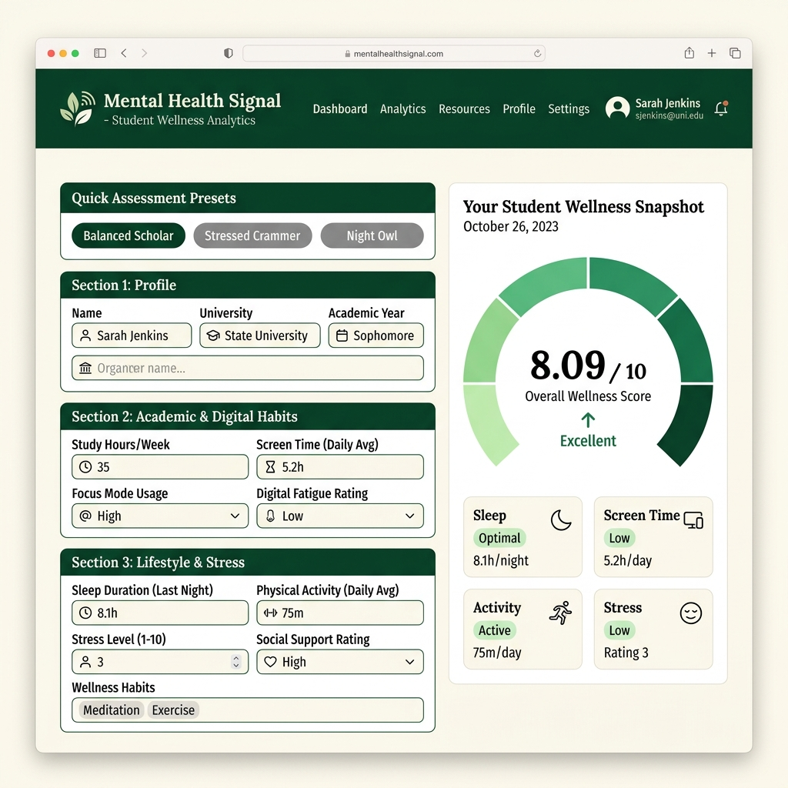
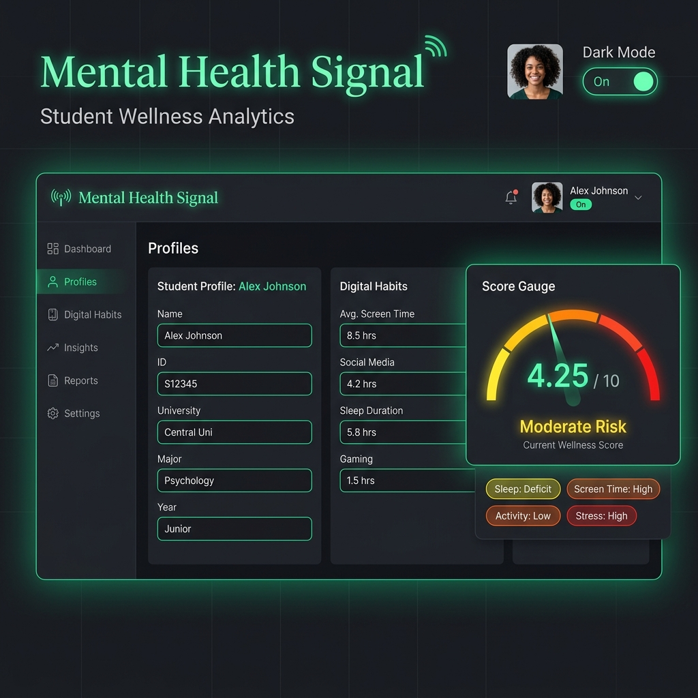

# 🧠 Mental Health Signal — Student Wellness Analytics

[](https://fastapi.tiangolo.com/)
[](https://www.python.org/)
[](https://scikit-learn.org/)
[](https://www.docker.com/)
[](LICENSE)

**Mental Health Signal** is an end-to-end Machine Learning web application that predicts and analyzes student mental health scores based on daily digital habits, screen time, phone unlocks, sleep patterns, study hours, physical activity, and perceived stress levels. 

---

## 📸 User Interface Preview

### ☀️ Light Mode Dashboard


### 🌙 Dark Mode Dashboard


---

## ✨ Key Features

- 🎯 **Predictive ML Analytics**: Instant calculation of student mental health score (0–10 scale) using a trained Machine Learning pipeline.
- ⚡ **One-Click Presets**: Pre-populated student lifestyle profiles for fast testing:
  - 🌱 **Balanced Scholar**: Optimal sleep, high activity, moderate study, low stress.
  - 🔥 **Stressed Crammer**: Excessive screen time, high study hours, minimal sleep, high stress.
  - 🌙 **Night Owl**: Late-night digital usage, irregular sleep, moderate exercise.
- 🌓 **Dynamic Light & Dark Theme**: Toggle between light and dark themes with persistent preference storage (`localStorage`).
- 📊 **Wellness Category Indicators**: Color-coded breakdown across **Sleep**, **Screen Time**, **Physical Activity**, and **Stress Level**.
- 📋 **Copy & Export**: One-click result summary copying to clipboard.
- 🛡️ **Robust Validation**: Server-side Pydantic schemas and client-side validation enforcing boundaries on inputs (e.g. valid age ranges, realistic hours).
- 🚀 **Production Ready**: Bundled with Docker containerization, `Procfile` for Heroku, and `render.yaml` for Render deployments.

---

## 🛠️ Technology Stack

| Layer | Technologies Used |
|---|---|
| **Frontend** | Vanilla HTML5, Custom Modern CSS (CSS Grid, Flexbox, Glassmorphism, Theme Variables), Vanilla JavaScript (ES6+) |
| **Backend** | Python 3.9+, FastAPI, Pydantic, Uvicorn, Gunicorn, StaticFiles |
| **Machine Learning** | Scikit-Learn (Pipeline & Regression), Pandas, NumPy, Joblib |
| **DevOps & Deploy** | Docker, Docker Compose, Render (`render.yaml`), Heroku (`Procfile`) |

---

## 📁 Repository Structure

```text
Mental-Health-Score/
├── docs/
│   └── screenshots/               # UI Screenshots for documentation
│       ├── dashboard_light.png
│       ├── dashboard_dark.png
│       ├── hero_preview.png
│       └── prediction_results_light.png
├── ML_Project.ipynb               # Jupyter notebook for EDA, feature engineering & model training
├── ML Project.html                # Exported HTML of model development notebook
├── Mental_Health_Model.pkl        # Serialized Machine Learning model pipeline
├── Student Social Media And...csv # Dataset used for model training
├── main.py                        # FastAPI backend application & API routes
├── index.html                     # Web application frontend page
├── style.css                      # Modern responsive styling & theme definitions
├── script.js                      # Interactivity, preset handlers & API integration
├── requirements.txt               # Python package dependencies
├── Dockerfile                     # Container construction file
├── render.yaml                    # Render cloud platform deployment configuration
└── Procfile                       # Heroku deployment process configuration
```

---

## 🤖 Machine Learning Workflow

The model pipeline translates student lifestyle data into a continuous mental health wellness score.

1. **Dataset**: Analyzes student social media usage, academic performance, and physical wellbeing metrics (`Student Social Media And Mental Health Impact.csv`).
2. **Feature Preprocessing**:
   - **Categorical Encoding**: `Gender`, `Academic_Level`, `Most_Used_Platform`, `Purpose_Of_Use`, `Stress_Level`.
   - **Grouped Categories**: Top country grouping for robust out-of-distribution handling (`Grouped_country`).
   - **Numerical Scaling**: Screen time, study hours, physical activity, phone unlocks, sleep hours.
3. **Model Serialization**: Exported via `joblib` into `Mental_Health_Model.pkl` for low-latency inference in FastAPI.

---

## 🚀 Quick Start & Installation

### Prerequisites
- Python 3.9+
- `pip` package manager

### 1. Clone the Repository
```bash
git clone https://github.com/your-username/Mental-Health-Score.git
cd Mental-Health-Score
```

### 2. Create a Virtual Environment
```bash
# Windows
python -m venv venv
venv\Scripts\activate

# macOS / Linux
python3 -m venv venv
source venv/bin/activate
```

### 3. Install Dependencies
```bash
pip install -r requirements.txt
```

### 4. Run the Server
```bash
python main.py
```
*Or using Uvicorn directly:*
```bash
uvicorn main:app --reload --port 8000
```

### 5. Open Web Application
Navigate to `http://localhost:8000` in your web browser.

---

## 🔌 API Documentation

FastAPI provides automatic interactive API documentation via Swagger UI.

- **Swagger Docs**: [http://localhost:8000/docs](http://localhost:8000/docs)
- **ReDoc**: [http://localhost:8000/redoc](http://localhost:8000/redoc)

### Health Check
- **Endpoint**: `GET /api/health`
- **Response**:
```json
{
  "status": "online",
  "service": "Mental Health Signal API",
  "version": "1.0.0"
}
```

### Predict Mental Health Score
- **Endpoint**: `POST /predict`
- **Content-Type**: `application/json`

#### Request Payload:
```json
{
  "age": 21,
  "gender": "Female",
  "country": "Canada",
  "academic_level": "Undergraduate",
  "most_used_platform": "Instagram",
  "purpose_of_use": "Entertainment",
  "avg_daily_usage_hours": 4.5,
  "daily_unlocks": 55,
  "study_hours": 6.0,
  "physical_activity_hours": 1.5,
  "sleep_hours_per_night": 7.5,
  "stress_level": "Medium"
}
```

#### Response:
```json
{
  "predicted_mental_health_score": 7.85
}
```

---

## 🐳 Docker Deployment

To build and run the application using Docker:

```bash
# Build Docker image
docker build -t mental-health-signal .

# Run container on port 8000
docker run -d -p 8000:8000 --name mental-health-app mental-health-signal
```

Access the app at `http://localhost:8000`.

---

## 📜 License

This project is open-source and available under the [MIT License](LICENSE).

---

<p align="center">
  <i>Built for educational and informational analytics — not intended for clinical diagnosis.</i>
</p>
